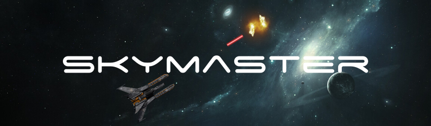

## About the app

  

### Skymaster

Skymaster is a fast-paced 2D space shooter game where you test your abilities to become the next executive officer aboard the Skymaster spaceship. Built using Unity and C#. Features a single and local co-op playing styles, different power-ups to aid you in the battle, and an awesome exploding sounds and graphics.

You can play the game [here](https://dvrzan.github.io/skymaster/index.html).

### Web browser support

Suggested web browsers: **Google Chrome** or **Mozilla Firefox**.
  
 Sound does not work on **Safari**.

## Concepts used / Features

* MVC Design Pattern
* Background loop to simulate forward flying
* Single and two player co-op modes
* Shield, Triple-shot, and Speed Boost Power-ups
* Music volume slider
* Score saving

  
  

>This is a university project created by my colleague Dino Aljevic and me for an Object Oriented Modeling course. Check my portfolio at [dvrzan.github.io/portfolio/](https://dvrzan.github.io/portfolio/)

  

